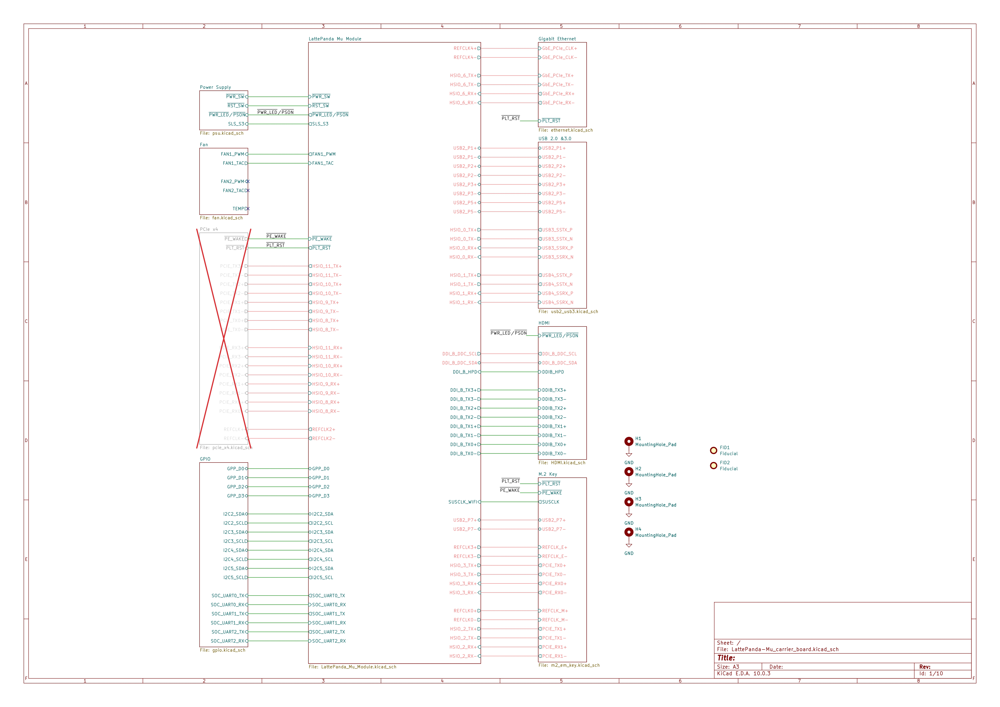
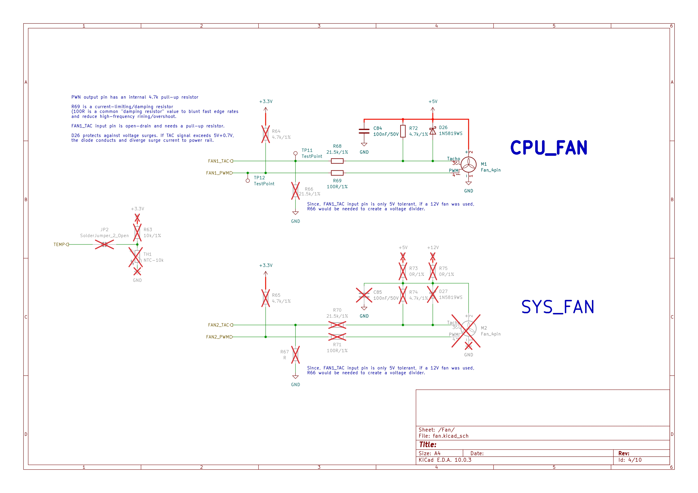
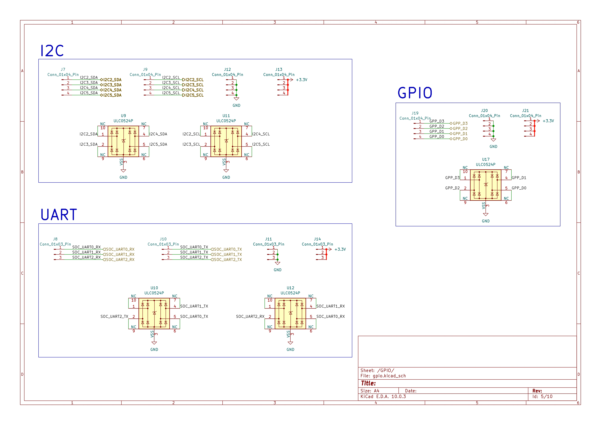
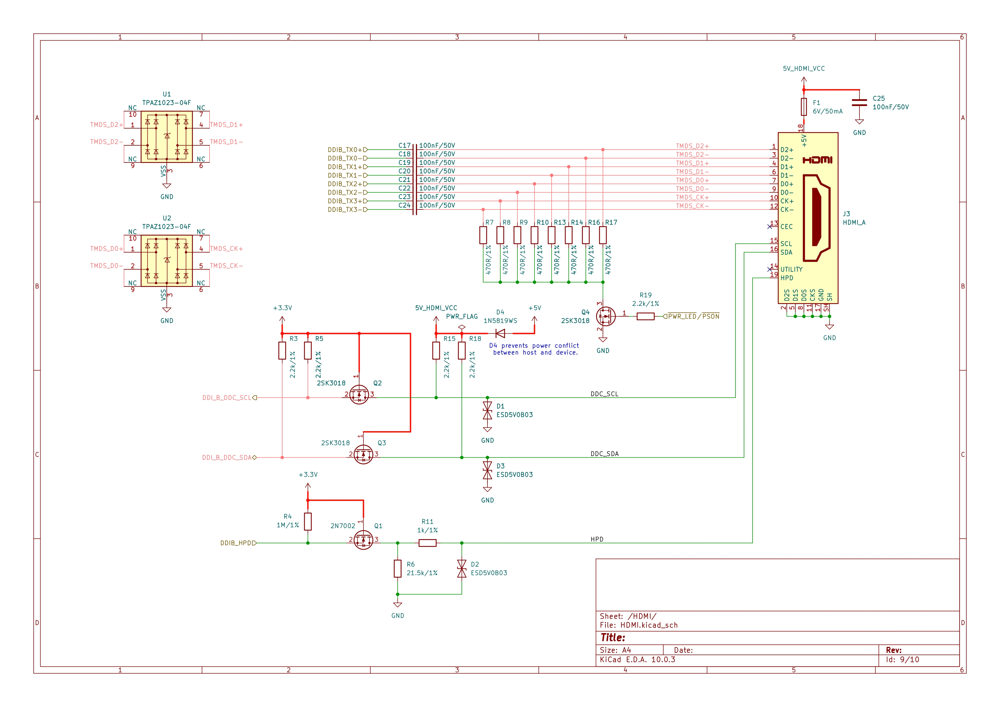
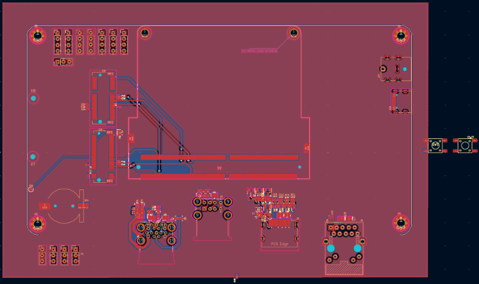

## What is it?
In an attempt to pick up some high-speed PCB skills before jumping onto my own personal high-speed project, I decided to buy a course from Tech Explorations and start from there. The project was a custom carrier board for the LattePanda Mu compute module.

The most important I learned from this project was about differential pairs routing, from sizing traces to the correct impedance depending on the stack-up, to preventing crosstalk, to matching trace length and preventing timing skew, to maintaining continuous reference plan and return path, as well as getting somewhat familiar to high-speed protocols like PCIe, Gbe Ethernet, USB3.9, HDMI, etc.

I have also decided to buy [another course](https://fedevel.com/courses/advanced-digital-hardware-design) on the same topic from Phil's Lab (there goes my wallet). This time, however, I won't be following the course and build a whole FPGA/SOC PCB. Instead, I will be using it as a guide to work on my upcoming project, which is going to be something about eDP or some other protocols to connect my laptop to a bare monitor. Can't wait!

## Status
18/09/2026

I have been grinding on the layout for the past few days. Last night, I let my laptop die without properly saving and closing the PCB editor. When I found out this morning that the layout work I had been working on was completely lost, I quickly checked the backup files.

To my surprise, there was none. I then found out that the automatic backup feature was not enabled. So now I am left with nothing to show for my work. At least now, my only comfort is the stuff I was able to learn about high-speed PCB design throughout this project.

In my original layout, USB3.0/2.0, Ethernet, HDMI, M.2 E&M Key, GPIO, I2C, UART, as well as the PSU had been laid out.

Below are the links to the photos of the schematics and the (old) layout. Somehow the schematic window was able to close down properly before my laptop died so they are up to date.

## Photos
<table>
  <tr>
    <td></td>
    <td></td>
  </tr>
  <tr>
    <td></td>
    <td></td>
  </tr>
  <tr>
    <td></td>
    <td></td>
  </tr>
  <tr>
    <td></td>
    <td></td>
  </tr>
  <tr>
    <td></td>
    <td></td>
  </tr>
  <td></td>
  <td><em>Layout progress at time of loss (unsaved crash - see write-up)</em></td>
</table>

